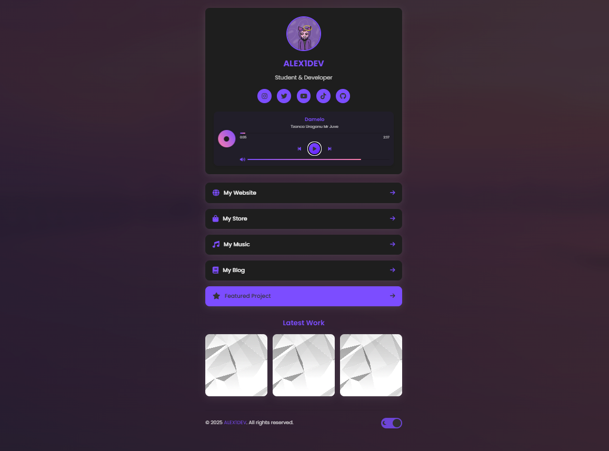

# Modern Link-in-Bio Template

[English](#english) | [Italiano](#italiano)

## English

A modern, responsive, and customizable link-in-bio template for social media profiles.



### Features

- 🎨 Modern design with smooth animations
- 🌓 Dark/Light mode toggle with auto-save preference
- 📱 Fully responsive for all devices
- ✨ Smooth animations and transitions
- 🖼️ Image gallery with project links
- 🔗 Customizable link cards with icons
- ⚡ Fast loading and optimized performance
- 🔍 SEO friendly
- 🌟 Animated background effect with parallax

### Getting Started

1. Clone this repository
2. Navigate to the project directory
3. Customize the HTML, images, and CSS to match your brand
4. Test locally
5. Deploy to your preferred hosting service

### Customization

#### Changing Colors

Edit the CSS variables in the `:root` selector in `css/style.css` to change the color scheme:

```css
:root {
    --bg-color: #f8f9fa;
    --card-bg: #ffffff;
    --text-color: #333333;
    /* other variables */
}
```

#### Adding New Links

To add a new link, copy and paste the following HTML structure in the `links-container` section:

```html
<a href="your-link-url" class="link-card" target="_blank">
    <div class="link-content">
        <i class="fas fa-icon-name"></i>
        <span>Link Title</span>
    </div>
    <i class="fas fa-arrow-right"></i>
</a>
```

#### Adding Featured Links

To make a link stand out, add the `featured` class to the link card:

```html
<a href="your-link-url" class="link-card featured" target="_blank">
    <!-- content -->
</a>
```

#### Customizing the Gallery

Edit the gallery items in the HTML file:

```html
<div class="gallery-item">
    
    <div class="gallery-overlay">
        <div class="gallery-links">
            <span class="github-link">
                <i class="fab fa-github"></i> View Code
            </span>
            <span class="project-link">
                <i class="fas fa-external-link-alt"></i> Live Demo
            </span>
        </div>
    </div>
</div>
```

#### Background Animation

The template includes an animated background effect using the image at `img/background.png`. The background features subtle movement and a gradient overlay that changes opacity over time, creating a dynamic visual experience.

To customize the background:

1. Replace the `background.png` file in the `img` folder with your own image
2. Adjust the animation parameters in the CSS file:

```css
/* Background Animation */
body::before {
    /* Change opacity, blur, or animation speed here */
    opacity: 0.6;
    filter: blur(3px);
    animation: backgroundAnimation 30s infinite alternate ease-in-out;
}

body::after {
    /* Adjust the gradient overlay */
    background: linear-gradient(135deg, var(--primary-color) 0%, transparent 100%);
    opacity: 0.3;
}
```

#### Music Player

The template includes a customizable music player with the following features:

- 🎵 Spinning disc animation that rotates during playback
- 🎼 Song title and artist display
- ⏮️ Previous track button
- ⏯️ Play/pause button
- ⏭️ Next track button
- 🔊 Volume control with mute option
- 📊 Progress bar with time display

To customize the music player:

1. Edit the playlist in the `index.html` file by modifying the `window.customPlaylist` array:

```javascript
window.customPlaylist = [
    {
        title: "Your Song Title",
        artist: "Artist Name",
        src: "path/to/your/audio/file.mp3"
    },
    // Add more songs as needed
];
```

2. You can use direct URLs to audio files or local files in your project
3. Customize the player's appearance by editing the CSS variables in `css/style.css`

## Italiano

Un template moderno, responsive e personalizzabile per creare una pagina di link per i profili social.


### Caratteristiche

- 🎨 Design moderno con animazioni fluide
- 🌓 Modalità chiara/scura con salvataggio automatico delle preferenze
- 📱 Completamente responsive per tutti i dispositivi
- ✨ Animazioni e transizioni fluide
- 🖼️ Galleria di immagini con link ai progetti
- 🔗 Card di link personalizzabili con icone
- ⚡ Caricamento veloce e prestazioni ottimizzate
- 🔍 SEO friendly
- 🌟 Effetto di sfondo animato con parallasse
- 🎵 Player musicale personalizzabile con controlli completi

### Per iniziare

1. Clona questa repository
2. Naviga nella directory del progetto
3. Personalizza l'HTML, le immagini e il CSS per adattarli al tuo brand
4. Testa localmente
5. Pubblica sul servizio di hosting che preferisci

### Personalizzazione

#### Cambiare i colori

Modifica le variabili CSS nel selettore `:root` nel file `css/style.css` per cambiare lo schema di colori:

```css
:root {
    --bg-color: #f8f9fa;
    --card-bg: #ffffff;
    --text-color: #333333;

}
```

#### Aggiungere nuovi link

Per aggiungere un nuovo link, copia e incolla la seguente struttura HTML nella sezione `links-container`:

```html
<a href="url-del-tuo-link" class="link-card" target="_blank">
    <div class="link-content">
        <i class="fas fa-nome-icona"></i>
        <span>Titolo del Link</span>
    </div>
    <i class="fas fa-arrow-right"></i>
</a>
```

#### Aggiungere link in evidenza

Per far risaltare un link, aggiungi la classe `featured` alla card del link:

```html
<a href="url-del-tuo-link" class="link-card featured" target="_blank">
    <!-- contenuto -->
</a>
```

#### Personalizzare la galleria

Modifica gli elementi della galleria nel file HTML:

```html
<div class="gallery-item">
    
    <div class="gallery-overlay">
        <div class="gallery-links">
            <span class="github-link">
                <i class="fab fa-github"></i> Vedi Codice
            </span>
            <span class="project-link">
                <i class="fas fa-external-link-alt"></i> Demo Live
            </span>
        </div>
    </div>
</div>
```

#### Animazione dello sfondo

Il template include un effetto di sfondo animato utilizzando l'immagine in `img/background.png`. Lo sfondo presenta un movimento sottile e una sovrapposizione di gradiente che cambia opacità nel tempo, creando un'esperienza visiva dinamica.

Per personalizzare lo sfondo:

1. Sostituisci il file `background.png` nella cartella `img` con la tua immagine
2. Regola i parametri di animazione nel file CSS:

```css
/* Animazione dello sfondo */
body::before {
    /* Modifica opacità, sfocatura o velocità di animazione qui */
    opacity: 0.6;
    filter: blur(3px);
    animation: backgroundAnimation 30s infinite alternate ease-in-out;
}

body::after {
    /* Regola la sovrapposizione del gradiente */
    background: linear-gradient(135deg, var(--primary-color) 0%, transparent 100%);
    opacity: 0.3;
}
```

#### Player Musicale

Il template include un player musicale personalizzabile con le seguenti caratteristiche:

- 🎵 Animazione del disco rotante durante la riproduzione
- 🎼 Visualizzazione del titolo della canzone e dell'artista
- ⏮️ Pulsante per la traccia precedente
- ⏯️ Pulsante play/pausa
- ⏭️ Pulsante per la traccia successiva
- 🔊 Controllo del volume con opzione muto
- 📊 Barra di avanzamento con visualizzazione del tempo

Per personalizzare il player musicale:

1. Modifica la playlist nel file `index.html` modificando l'array `window.customPlaylist`:

```javascript
window.customPlaylist = [
    {
        title: "Titolo della tua canzone",
        artist: "Nome dell'artista",
        src: "percorso/al/tuo/file/audio.mp3"
    },
    // Aggiungi altre canzoni secondo necessità
];
```

2. Puoi utilizzare URL diretti a file audio o file locali nel tuo progetto
3. Personalizza l'aspetto del player modificando le variabili CSS in `css/style.css`
